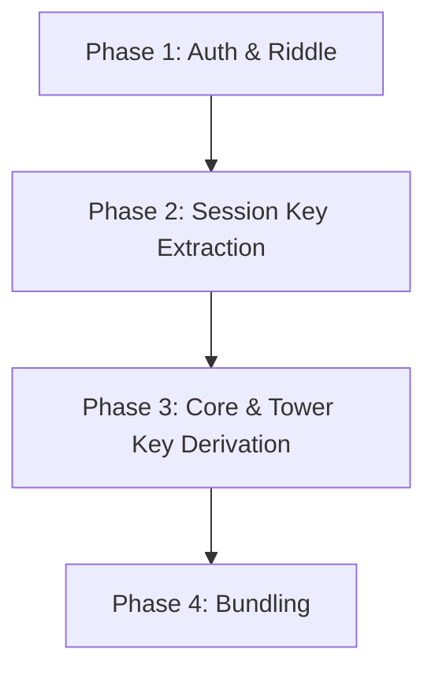

# This document outlines the step-by-step sequence and phase breakdown for generating authentication vectors within 4G LTE networks.

---

## 📋 Step-by-Step Sequence

### 1. Generating IK (Integrity Key) via F4 Function
> **Purpose:** Derives a 128-bit key used to sign data packets sent between the mobile phone and the base station. This prevents an attacker from altering or injecting malicious commands into the network signaling.

### 2. Generating CK (Cipher Key) via F3 Function
> **Purpose:** Derives a 128-bit key used to encrypt user data (voice and internet traffic). This ensures eavesdroppers cannot spy on your calls or data.

### 3. Generating MAC (Message Authentication Code) via F1 Function
> **Purpose:** Acts as a cryptographic checksum to prove the network is legitimate. This prevents a "Fake Base Station" (IMSI Catcher/Stingray) from hijacking your phone, as only a real network can generate a valid MAC using the secret key shared with your SIM card.

### 4. Generating XRES (Expected Response) via F2 Function
> **Purpose:** Serves as the "answer" to a riddle. The network sends a random number (`RAND`) to the phone. The phone must use `RAND` to calculate its own `RES`. If the phone's `RES` matches the network's `XRES`, the network knows the phone is real.

### 5. Assembling the AUTN (Authentication Token)
> **Purpose:** Packages the Sequence Number (`SQN`), Authentication Management Field (`AMF`), and `MAC` together. This entire block is sent to the mobile device so the phone can verify the network's identity before sending any sensitive data.

### 6. Constructing the Authentication Vector (V)
> **Purpose:** Consolidates all calculated outputs (`RAND`, `XRES`, `CK`, `IK`, `AUTN`) into a single, standardized block of data. In a real network, the core home network generates this bundle and passes it to the local cell tower you are connecting to, giving the tower everything it needs to handle your session securely.

### 7. Generating $K_{ASME}$ (Access Security Management Entity Key)
> **Purpose:** A 4G LTE specific step. It takes components of the authentication process and derives a master key specific to the region/operator you are visiting. This key stays safely in the network core and is used to spin up temporary session keys.

### 8. Generating $K_{eNB}$ (eNodeB / Base Station Key)
> **Purpose:** Derives a unique encryption key specifically for the exact cell tower (eNodeB) your phone is connected to right now. If you drive to a new area and switch to a different cell tower, a new $K_{eNB}$ is instantly calculated so that a breach of one physical tower doesn't compromise the whole network.

---

## ⚙️ Phase-by-Phase Breakdown

### Phase 1: Authentication & Riddle Generation
* **MAC Generation (F1):** Processes the configuration string to create a cryptographic seal. This guarantees to the phone that the message originated from a valid cellular network.
* **XRES Generation (F2):** Creates the target verification string. This is the expected answer the phone must compute to log into the tower.
* **AUTN Packaging:** Concatenates the Sequence Number, Authentication Management Field, and the generated MAC into a single, cohesive network token.

### Phase 2: Session Key Extraction
* **Cipher Key (F3) & Integrity Key (F4):** Simultaneously derived from the base identity logs. These provide separate layers for data encryption (`CK`) and signal tampering protection (`IK`).

### Phase 3: Core & Tower Key Derivation
* **$K_{ASME}$ Master Key:** Pulls global parameters to anchor a root key for the access network domain.
* **$K_{eNB}$ Local Key:** Consumes the newly generated master key to spawn a localized, single-tower encryption key.

### Phase 4: Bundling
* **Vector Vector (V) Assembly:** Appends the initial `RAND`, the verification `XRES`, both session keys (`CK`/`IK`), and the network verification token (`AUTN`) into a unified memory buffer.
"""

